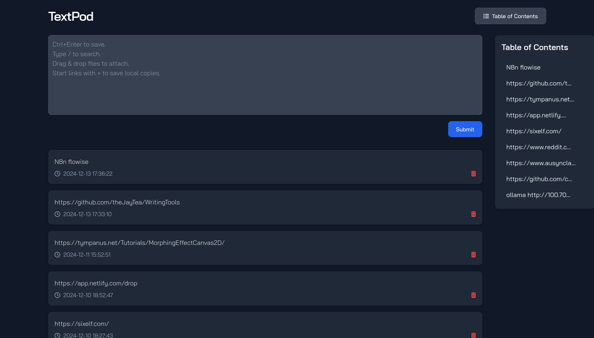

# Textpod

This is a fork of [freetonik/textpod](https://github.com/freetonik/textpod) but with a few minor changes

  
## Features

- Updated UI styling with [Flowbite](https://flowbite.com) and [Lucide Icon](https://lucide.dev/icons/)
- Extra feature: Table of Content (inspired by this [reddit comment](https://www.reddit.com/r/selfhosted/comments/1gl3sqh/comment/lvs3ius/)
- Set [Bai Jamjuree](https://fonts.google.com/specimen/Bai+Jamjuree) as the default font
- Local-first: all data stored on your machine
- Fast and lightweight
- Responsive design



## Installation

### Option 1: Using Docker

The easiest way to run Textpod is using Docker:

```bash
docker run -d -p 3000:3000 -v $(pwd)/data:/app namvu87/textpod-toc:latest
```

Or using docker-compose:

```bash
git clone https://github.com/vnt87/textpod-toc.git
cd textpod-toc
docker-compose up -d
```

### Option 2: Building from source

1. Make sure you have Rust installed. If not, install it from [rustup.rs](https://rustup.rs/)
2. Clone this repository:
   ```bash
   git clone https://github.com/vnt87/textpod-daisyui.git
   cd textpod-daisyui
   ```
3. Build and run:
   ```bash
   cargo build
   cargo run
   ```
4. Open your browser and navigate to `http://localhost:3000`

### Option 3: Deploy on Vercel
[](https://vercel.com/new/clone?repository-url=https%3A%2F%2Fgithub.com%2Fvnt87%2Ftextpod-toc)

## But...why though? Isn't Textpod meant to be dead simple?

Yes, but I'm a Product Designer by trade and I wanted to spice up the UI a bit.

## Why should I use this version instead of the original?

You uh, probably shouldn't. I'm not a developer so these features were written with extensive help of AI, so there's probably a bunch of unnecessary codes in there. I mean, some of them wasn't even the AI's fault. I embedded an entire icon library just so I could use 2 icons. 


## Contributing

Feel free to open issues and pull requests. I want to keep the code very simple and accessible to beginners. The goal is not to create another feature-rich note-taking app, but to keep it simple and fast.
A "one big text file" idea is very powerful and I just want to make it slightly enhanced.
